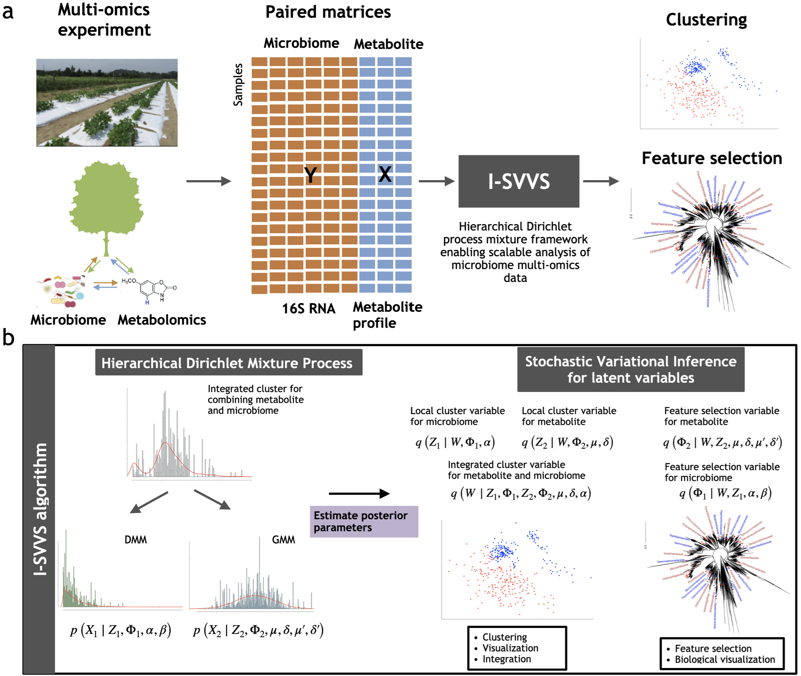

# I-SVVS : Integrative stochastic variational variable selection

## Publication
Dang, Tung, et al. "I-SVVS: Integrative stochastic variational variable selection to explore joint patterns of multi-omics microbiome data" bioRxiv (2024): 2024-10 | [https://doi.org/10.1093/bib/bbaf132](https://doi.org/10.1093/bib/bbaf132) [https://doi.org/10.1101/2023.08.18.553796](https://doi.org/10.1101/2023.08.18.553796)


## The workflow of the algorithm



## Directory structure

### Data

- The main files for dataset A of our paper in the ```data/``` folder include: 
    - datasetA_microbiome.csv: a microbiome OTU count table for dataset A 
    - datasetA_metabolome.csv: a metabolome table for dataset A 
    - datasetA_microbiome-tree.qza: microbiome phylogenetic tree for dataset A
- Please follow instructions in the [haddad_osa github repo](https://github.com/knightlab-analyses/haddad_osa/) to get OTU tables, metabolome and microbiome phylogenetic tree for datasets B. 
- Please follow instructions in the [MicrobiomeHD github repo](https://github.com/cduvallet/microbiomeHD) to get OTU tables, metabolome and microbiome phylogenetic tree for datasets C. 

### Source code

All of the code is in the ```src/``` folder, you can use to re-make the analyses in the paper:

- Integrated_SVVS.py: file contains Python codes for I-SVVS algorithm that analyze microbiome and metabolome datasets.
- DMM_SVVS.py: file contains Python codes for analyzing only microbiome.
- GMM_SVVS.py: file contains Python codes for analyzing only metabolome.

If you have any problem, please contact me via email: dangthanhtung91@vn-bml.com  
